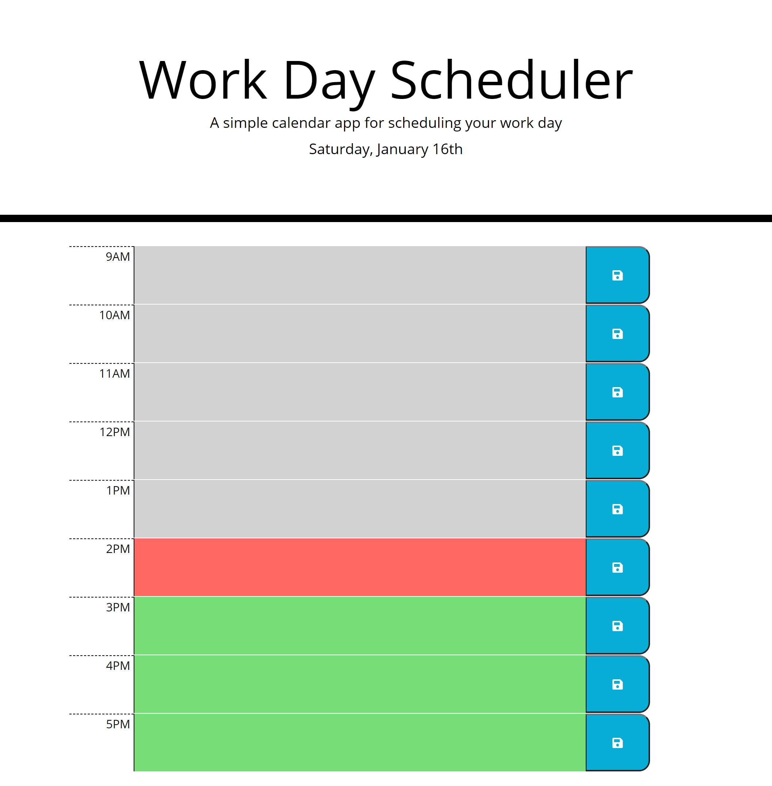

# day-planner-application

## Description

The purpose of this project was to create a functional working day planner with a few objectives in mind. It would show the current day as a subtitle
at the top of the page and cover each hour in a working day (9AM-5PM). It also needed to show the hours prior to the current time in grey, the current hour
in red, and the future in green, while storing the text written next to each hour when the user clicks the save button so it could be displayed even if the
page was refreshed/closed.

The time-based aspects of the web page were done using the moment.js library, while the text storage was done using the basic local storage in the application.
Most of the HTML displayed on the page was created dynamically using jQuery DOM methods, to make the process of adding the information retrieved from moment.js
and local storage a little smoother.

## Screenshots

## Links

- Repo (Yes this one): https://github.com/TopGek99/day-planner-application
- Webpage: https://topgek99.github.io/day-planner-application